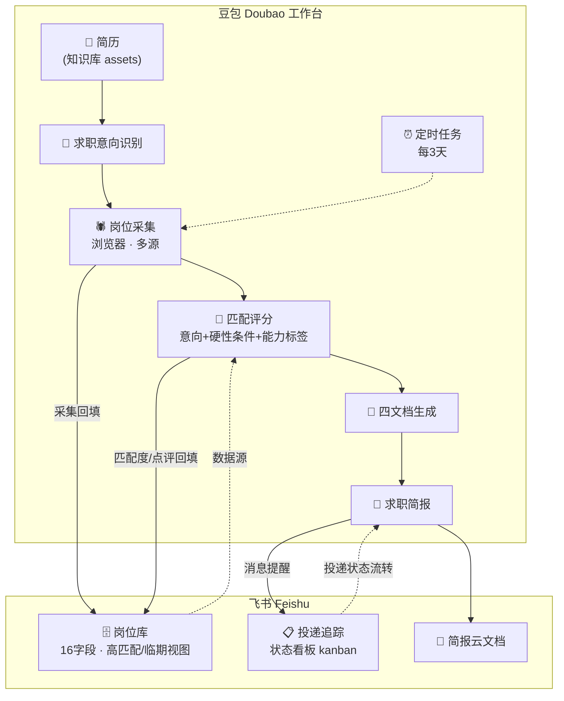
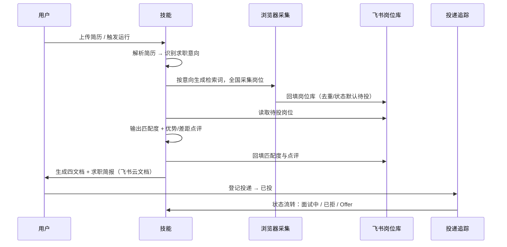

<div align="center">

# 🎯 AI 求职管家 · AI Job Manager

**豆包原生 · 简历驱动 · 求职全流程自动化管家**

上传简历 → 识别求职意向 → 全国采集匹配岗位 → 飞书多维表格沉淀 → 智能评分 → 求职简报推送

[](LICENSE)
[](https://www.doubao.com)
[](https://www.feishu.cn)
[](https://github.com/lzlin3459-hash/ai-job-manager/pulls)

> 无需独立部署 · 无需外部 AI 模型 · 无需写代码 —— 把技能装进豆包，即刻拥有你的求职作战室。

</div>

---

## 📖 项目定位

「AI 求职管家」是一个运行在 **豆包（Doubao）** 内的求职自动化技能包。它不再用固定的关键词碰运气筛岗，而是：

> **上传简历 → 识别简历对应的求职意向 → 从全国筛选对应的企业与岗位**

并将整个求职过程沉淀为可长期运营的飞书资产：岗位库（采集/去重/下架循环）、投递追踪（状态看板流转）、求职简报（每 3 天自动推送）。

### 设计理念

| 理念 | 落地方式 |
|---|---|
| 🎯 **意向驱动，而非标签驱动** | 先识别简历求职意向（如 ToB 企业服务 / AI 解决方案销售），再按意向生成检索词、筛岗、评分；方向不符的岗位自动降权，不浪费投递精力 |
| 🗄️ **数据即资产** | 岗位库 + 投递追踪沉淀于飞书多维表格，一次搭建、持续运营，随时更替、及时更新 |
| 🔌 **采集路径可替换** | 默认优先企业官方招聘官网（免登录、可溯源）；BOSS 直聘/猎聘需登录时由用户接管浏览器完成验证 |
| 🧩 **零部署、零模型** | 全部逻辑运行在豆包技能 + 飞书生态内，无需服务器、无需外部大模型 API |

---

## ✨ 核心能力

<table align="center">
<tr>
<td width="50%">

**📄 简历解析与画像**

- 读取知识库简历（PDF / Word），结构化提取经历、技能、教育背景
- 识别求职意向并提炼能力标签，输出行业适配度评分（0–100）

**🕷️ 岗位采集与沉淀**

- 按求职意向生成检索关键词，全国范围采集
- 支持企业官网 / BOSS 直聘 / 猎聘等多源
- 岗位库自动去重（岗位+公司+城市），超期自动标记"已下架"

**🧮 智能匹配评分**

- 硬性条件过滤（经验 / 学历 / 薪资区间）
- 求职意向相关度 + 能力标签双维度评分
- 每条岗位输出"优势 / 差距"点评，评分依据可追溯

</td>
<td width="50%">

**📝 四文档自动生成**

- ① 行业与岗位综合分析
- ② 当前开放匹配岗位清单（≥80 分与临期岗位红色标注）
- ③ 优化版简历（按目标岗位关键词重写）
- ④ STAR 版简历（情境-任务-行动-结果重构）

**📨 简报与投递联动**

- 《求职简报》输出为飞书云文档 + 消息提醒
- 投递追踪看板：待投 → 已投 → 面试中 → 已拒 / Offer

**⏰ 定时自动运行**

- 每 3 天自动刷新岗位库、重算匹配、推送简报（可选）

</td>
</tr>
</table>

---

## 🏗️ 系统架构



---

## 🔄 工作流程



---

## 🚀 快速开始

> **前提**：豆包电脑客户端 + 一个飞书账号（个人版或企业版均可，二选一使用）。

```bash
# 1. 创建技能
豆包工作台 → 创建技能 → 名称「AI 求职管家」
#    将 skill/SKILL.md 的「核心指令」完整粘贴为技能指令

# 2. 上传简历
技能知识库/assets ← 上传你的简历（PDF / Word）

# 3. 搭建飞书多维表格
按 feishu-base/README.md 创建「豆包求职管家」Base：
#    岗位库（16字段 + 高匹配/临期视图）
#    投递追踪（10字段 + 状态看板）

# 4. 授权飞书连接器
豆包 → 授权飞书（读写多维表格 / 创建云文档 / 发送消息）

# 5. 运行
对话中： "用 AI 求职管家，帮我跑一轮求职分析"
或配置：  每 3 天定时任务自动运行
```

---

## 📂 目录结构

```
ai-job-manager/
├── README.md                        # 项目文档（本文件）
├── LICENSE                          # MIT License
├── skill/
│   ├── SKILL.md                     # 技能指令（粘贴进豆包即用）
│   ├── references/
│   │   └── job-tracker-tables.md    # 飞书多维表格数据规范
│   └── assets/
│       └── README.md                # 简历上传说明（仓库不含真实简历）
└── feishu-base/
    ├── README.md                    # 飞书 Base 搭建指南（手动 / JSON 导入）
    ├── 岗位库-字段定义.json          # 岗位库字段定义（可导入建表）
    └── 投递追踪-字段定义.json        # 投递追踪字段定义（可导入建表）
```

---

## 🗄️ 数据模型

### 岗位库（16 字段）

| 字段 | 类型 | 说明 |
|---|---|---|
| 岗位名称 | 文本（主字段） | 岗位全称 |
| 公司 / 城市 / 行业板块 | 文本 / 文本 / 单选 | 板块：食品企业 · 互联网企业 · 其他（可扩展） |
| 薪资范围 / 经验要求 / 学历要求 | 文本 | 结构化门槛信息 |
| 岗位链接 | 文本 | 企业官网 / 招聘平台详情链接 |
| 发布日期 / 截止日期 | 日期 | 长期开放可留空截止 |
| 关键词标签 | 多选 | 与求职意向匹配的标签（ToB销售 / 大客户销售 / AI / 校招 …） |
| 匹配度 | 数字 | 0–100，意向+硬性条件+能力标签计算 |
| 状态 | 单选 | 待投 / 已投 / 面试中 / 已拒 / 已下架 |
| 抓取日期 | 日期 | 采集当天 |
| 剩余天数 | 公式 | `DAYS([截止日期],TODAY())`，驱动临期视图 |
| 备注 | 文本 | 优势/差距点评、来源说明 |

### 投递追踪（10 字段）

| 字段 | 说明 |
|---|---|
| 岗位名称 / 公司 / 行业板块 / 城市 / 岗位链接 | 岗位信息（同岗位库口径） |
| 投递日期 | 实际投递当天 |
| 状态 | 待投 → 已投 → 面试中 → 已拒 / Offer（看板五列流转） |
| 匹配度 | 投递时岗位库评分 |
| 面试时间 / 反馈备注 | 面试与跟进记录 |

---

## 🛡️ 隐私与安全

- **仓库零个人数据**：不含任何真实简历、飞书 token、账号信息或采集数据；所有个人数据仅存在于使用者自己的豆包与飞书空间。
- **只读公开信息**：采集仅读取企业官网 / 招聘平台公开页面，不涉及爬虫对抗、验证码绕过或账号自动化投递。
- **最小权限**：技能仅在你授权的飞书连接器范围内读写，可随时撤销。
- 建议 fork 后保留 `.gitignore`（默认排除 `*.pdf` / `*.docx` 等个人文件），防止误提交简历。

---

## ❓ FAQ

**Q：必须用食品/互联网板块吗？**
不是。目标板块与检索关键词是可配置项，技能会按使用者的简历求职意向自动生成检索词；`skill/SKILL.md` 中保留的是作者使用示例。

**Q：个人飞书和企业飞书能互通吗？**
不互通（豆包账号=个人空间，飞书账号=企业身份）。二选一使用即可，技能在两套环境均可运行。

**Q：BOSS 直聘搜索需要登录怎么办？**
浏览器操作遇到登录/验证时，技能会引导使用者接管浏览器完成验证（豆包内置交互能力），验证后继续自动采集。

**Q：需要付费开通豆包「工作伙伴」吗？**
不需要。本技能仅依赖豆包基础技能能力 + 飞书连接器，无额外付费项。

---

## 🤝 贡献指南

欢迎提交 Issue 与 PR：

- 新增行业板块预设（制造 / 零售 / 医疗 / 新能源 …）
- 一键创建飞书 Base 的自动化脚本（API 版）
- 简历一键导出 PDF 投递版
- 多语言 / 多地区适配

提交前请确保不包含个人敏感数据（简历、token、账号信息）。

---

## 📄 License

[MIT](LICENSE) © 2026 AI Job Manager Contributors — 可自由使用、修改、分发（含商用），请保留原作者署名。
